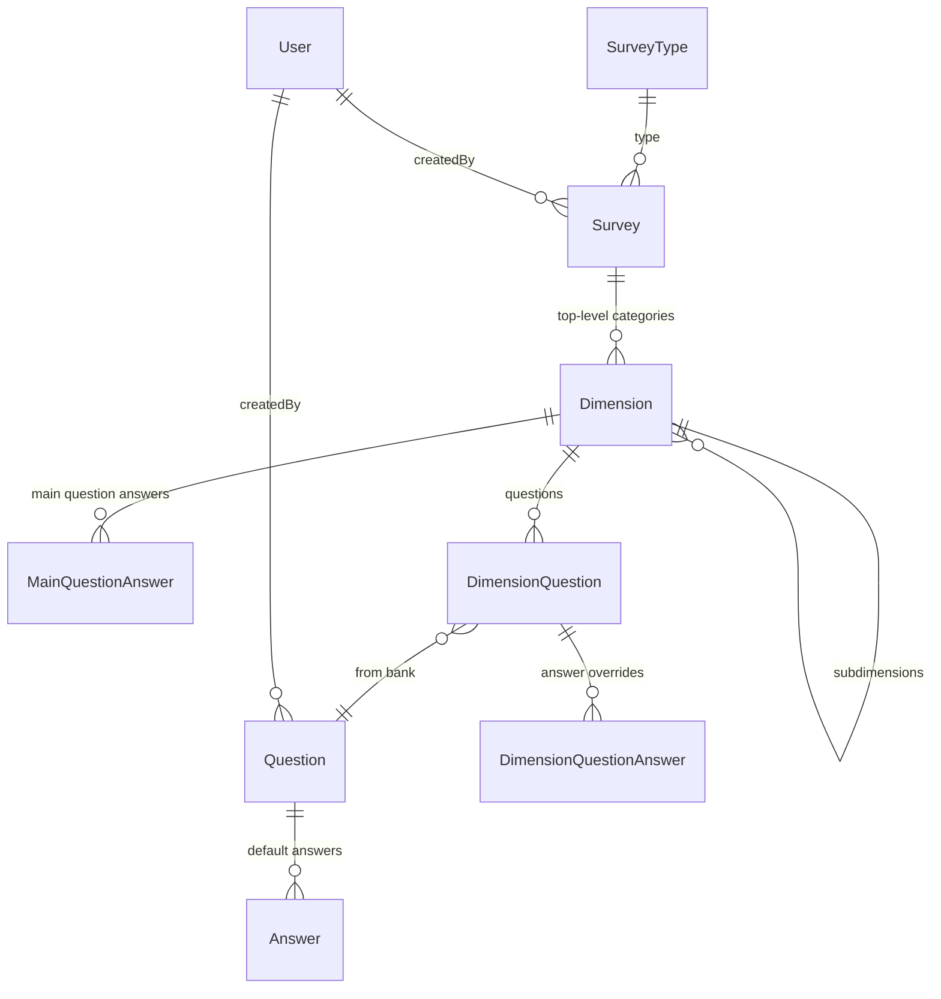

# Survey Entities Implementation

## Entity Model



---

## 1. Prisma Schema Design

### Survey

| Field                | Type     | Notes            |
| -------------------- | -------- | ---------------- |
| id                   | uuid     |                  |
| title                | string   |                  |
| surveyTypeId         | string   | FK to SurveyType |
| description          | string?  |                  |
| createdById          | string   | FK to User       |
| createdAt, updatedAt | DateTime |                  |

### Dimension (nested via parentDimensionId)

| Field                | Type     | Notes                                |
| -------------------- | -------- | ------------------------------------ |
| id                   | uuid     |                                      |
| surveyId             | string   | FK to Survey                         |
| parentDimensionId    | string?  | Self-ref for subdimensions           |
| title                | string   |                                      |
| description          | string?  |                                      |
| weighting            | Float?   | Optional                             |
| mainQuestionText     | string?  | Special question for whole dimension |
| order                | Int?     | Order within parent                  |
| createdAt, updatedAt | DateTime |                                      |

### MainQuestionAnswer (answers for dimension's main question)

| Field                | Type     | Notes                           |
| -------------------- | -------- | ------------------------------- |
| id                   | uuid     |                                 |
| dimensionId          | string   | FK to Dimension                 |
| text                 | string   |                                 |
| sortOrder            | Int?     | Optional, for display order     |
| value                | Float    | Score when selected             |
| reverseValue         | Float?   | Score when question is reversed |
| createdAt, updatedAt | DateTime |                                 |

### Question (bank – reusable)

| Field                | Type     | Notes         |
| -------------------- | -------- | ------------- |
| id                   | uuid     |               |
| title                | string   |               |
| text                 | string   | Question text |
| weight               | Float?   |               |
| isReversed           | Boolean  | Default false |
| isMultiAnswer        | Boolean  | Default false |
| createdById          | string   | FK to User    |
| createdAt, updatedAt | DateTime |               |

### Answer (belongs to Question)

| Field                | Type     | Notes                  |
| -------------------- | -------- | ---------------------- |
| id                   | uuid     |                        |
| questionId           | string   | FK to Question         |
| text                 | string   |                        |
| sortOrder            | Int?     | Optional, auto-managed |
| value                | Float    |                        |
| reverseValue         | Float?   | Used when isReversed   |
| createdAt, updatedAt | DateTime |                        |

### DimensionQuestion (join: dimension uses question, with overrides)

| Field                 | Type     | Notes                    |
| --------------------- | -------- | ------------------------ |
| id                    | uuid     |                          |
| dimensionId           | string   | FK to Dimension          |
| questionId            | string   | FK to Question (bank)    |
| order                 | Int?     | Order within dimension   |
| weightOverride        | Float?   | Override question weight |
| isReversedOverride    | Boolean? | Override                 |
| isMultiAnswerOverride | Boolean? | Override                 |
| createdAt, updatedAt  | DateTime |                          |

### DimensionQuestionAnswer (optional answer overrides per usage)

| Field                | Type     | Notes                   |
| -------------------- | -------- | ----------------------- |
| id                   | uuid     |                         |
| dimensionQuestionId  | string   | FK to DimensionQuestion |
| answerId             | string   | FK to Answer (original) |
| valueOverride        | Float?   | Override value          |
| reverseValueOverride | Float?   | Override reverseValue   |
| orderOverride        | Int?     | Override sortOrder      |
| createdAt, updatedAt | DateTime |                         |

---

## 2. Implementation Plan

### Phase 1: Prisma Schema

Add all models to [prisma/schema.prisma](prisma/schema.prisma) with proper relations:

- SurveyType 1–N Survey
- Survey 1–N Dimension (top-level: parentDimensionId = null)
- Dimension self-ref for subdimensions
- Dimension 1–N MainQuestionAnswer
- Question 1–N Answer
- Dimension N–N Question via DimensionQuestion (with override fields)
- DimensionQuestion 0–N DimensionQuestionAnswer (for per-usage answer overrides)
- User relations for Survey and Question

### Phase 2: Backend (NestJS)

Extend [apps/web-server/src/app/survey/](apps/web-server/src/app/survey/):

- **Resolvers/Services** (can be split or combined):
  - `survey.resolver.ts` / `survey.service.ts` – CRUD for Survey, include dimensions. On `createSurvey`, if `surveyType.hasCategories === false`, create a single default dimension in the same transaction
  - `dimension.resolver.ts` / `dimension.service.ts` – CRUD for Dimension (nested), mainQuestionAnswers
  - `question.resolver.ts` / `question.service.ts` – CRUD for Question bank; query `surveysUsingQuestion(questionId)` via DimensionQuestion → Dimension → Survey
  - `dimension-question.resolver.ts` / service – add/remove/reorder questions in dimensions, apply overrides
- **DTOs**: Entity and Input types for each model (following [company/dto](apps/web-server/src/app/company/dto/) pattern).
- **Key queries**:
  - `surveys`, `survey(id)`, `createSurvey`, `updateSurvey`, `deleteSurvey`
  - `dimensions(surveyId)`, `dimension(id)`, `createDimension`, `updateDimension`, `deleteDimension`
  - `questions` (bank), `question(id)`, `surveysUsingQuestion(questionId)`, `createQuestion`, `updateQuestion`, `deleteQuestion`
  - `addQuestionToDimension`, `removeQuestionFromDimension`, `updateDimensionQuestionOverrides`

### Phase 3: Frontend (Angular)

Create features under `apps/web-app/src/app/`:

- **Question bank** (`question-bank/`): list questions, show "Used in: Survey A, Survey B", create/edit/delete, filter
- **Survey builder** (`surveys/`): list surveys, create/edit survey (title, type, description). Dimension UI driven by survey type: `hasCategories=false` → single auto-created dimension only (no add-dimension UI); `hasCategories=true` → full dimension management. If `hasSubcategories=false`, hide add-subdimension UI (dimensions stay flat); if `hasSubcategories=true`, show add-subdimension for nested dimensions. Add questions from bank to dimensions with overrides, configure main question per dimension
- **GraphQL** ops for all entities
- **Routing**: `/dashboard/question-bank`, `/dashboard/question-bank/:id`, `/dashboard/surveys`, `/dashboard/surveys/:id`
- **Navigation**: add "Question Bank" and "Surveys" to [dashboard-shell.ts](apps/web-app/src/app/dashboard/dashboard-shell.ts)

---

## 3. Survey Type – Categories Behavior

When creating/editing a survey, the survey type drives dimension visibility:

- **SurveyType.hasCategories = false**:
  - On survey creation, auto-create a single dimension (e.g. default title "General" or empty)
  - In the survey builder UI: hide "Add dimension" and any controls to create additional dimensions; the user only sees and edits that single dimension
- **SurveyType.hasCategories = true**:
  - Show full dimension management: add dimensions, reorder, delete
  - **SurveyType.hasSubcategories = false**: hide "Add subdimension" and any controls to create nested child dimensions; dimensions are always top-level only
  - **SurveyType.hasSubcategories = true**: show option to add subdimensions (nested child dimensions) within dimensions

**Backend**: `createSurvey` must create the initial dimension when `surveyType.hasCategories === false`. The frontend reads `survey.surveyType.hasCategories` and `survey.surveyType.hasSubcategories` to decide whether to show dimension and subdimension CRUD controls.

---

## 4. Question Bank – "Surveys Using" Feature

For each question in the bank:

- Query: `surveysUsingQuestion(questionId)` returns `{ surveyId, surveyTitle, dimensionTitle }[]`
- Backend: `DimensionQuestion` JOIN `Dimension` JOIN `Survey` WHERE `questionId = ?`
- Frontend: In question list/detail, show badge or list: "Used in: Survey X (Dimension A), Survey Y (Dimension B)"

---

## 5. Migration

Run `npx prisma migrate dev --name add_survey_entities` after schema changes.

---

## 6. Implementation Order

1. Prisma schema + migration
2. Backend DTOs
3. Backend services + resolvers (survey, dimension, question, dimension-question)
4. Frontend GraphQL + question bank UI
5. Frontend survey builder UI (dimensions tree, add questions, overrides)
6. Wire routing and navigation

---

## Key Files to Create/Modify

```
prisma/schema.prisma                    # Add Survey, Dimension, Question, Answer, etc.
apps/web-server/src/app/survey/
  survey.resolver.ts, survey.service.ts
  dimension.resolver.ts, dimension.service.ts
  question.resolver.ts, question.service.ts
  dimension-question.resolver.ts, dimension-question.service.ts
  dto/*.entity.ts, dto/*.input.ts
apps/web-app/src/app/question-bank/
  graphql/*.graphql
  question-bank-list.ts
  question-form.ts
apps/web-app/src/app/surveys/
  graphql/*.graphql
  surveys-list.ts
  survey-form.ts (with dimension tree, add-question UI)
```
